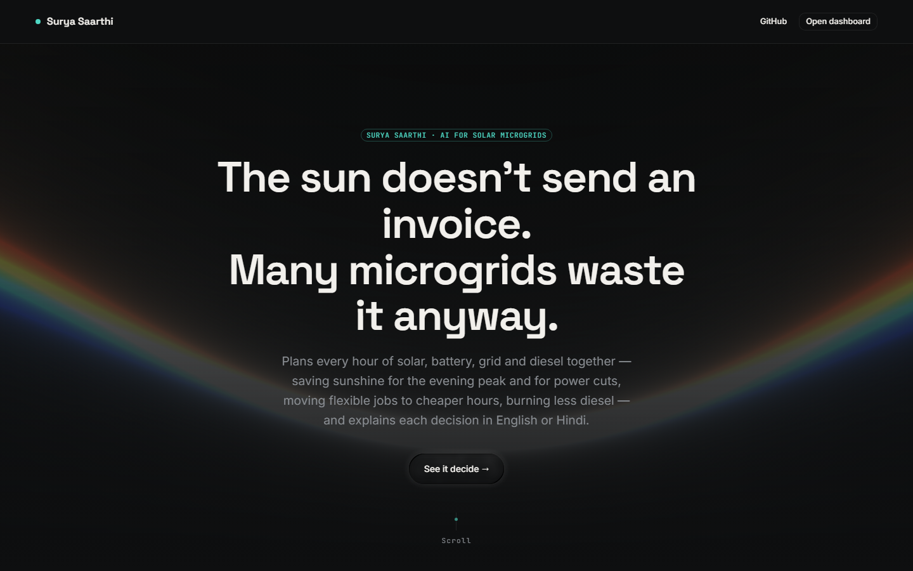
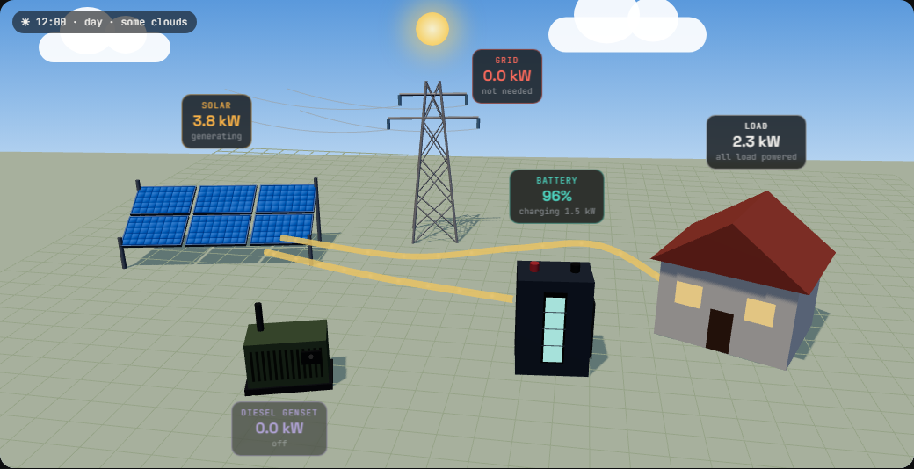
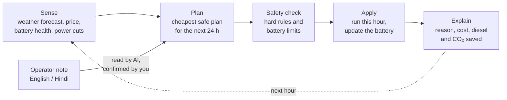

# Surya Saarthi

**A smart energy manager for solar microgrids.** Every hour it plans the next 24 hours of solar, battery, grid and diesel generator together, so essential power stays on through power cuts at the lowest cost, and it explains every decision in plain English or Hindi.

Smart India Hackathon 2026 · Problem Statement **SIH26200** (Renewable / Sustainable Energy) · Team **BOOMERS**

**Live demo:** [surya-saarthi.vercel.app](https://surya-saarthi.vercel.app) &nbsp;·&nbsp; **API:** [surya-saarthi.onrender.com/docs](https://surya-saarthi.onrender.com/docs)

> The backend runs on a free server that sleeps when idle. The first visit can take about a minute to wake it up.



## The problem

Schools, clinics, shops and village mini-grids in India often have rooftop solar, a battery and a diesel generator, but they run on fixed rules. The battery is often empty when an evening power cut starts, so the generator burns diesel for hours, and power is bought at the costly evening price.

## What Surya Saarthi does

- **Plans ahead.** Every hour it looks at the next 24 hours of sun forecast, electricity price, battery health and expected power cuts, and picks the cheapest safe plan.
- **Ready for power cuts.** It fills the battery with sunshine before a cut, so the generator runs only when really needed.
- **Moves flexible jobs.** Water pumps and EV charging run in sunny or cheaper hours and still finish on time.
- **Safety first.** Fixed rules check every step before it runs: battery never below 20%, key loads always on, no charging from the grid.
- **Explains itself.** Each hour shows what it decided and why, in English or Hindi.
- **Understands notes.** Type *"kal shaam 7 se 10 bijli jayegi"* (power cut 7–10 pm tomorrow) and it adds the cut to the plan after you confirm. The AI only reads notes; it never switches anything on or off.
- **Just software.** It works with the solar, battery and generator a site already has.



## Results (computer test, not a field trial)

Four recorded weeks of Delhi weather (January, May, July, September 2026), a 10 kW solar array, 10 kWh battery and 5 kW diesel generator, compared with a typical fixed-rule controller under exactly the same conditions:

| | Fixed rule | Surya Saarthi | Change |
|---|---|---|---|
| Running cost, grid normal | ₹12,049 | ₹10,845 | **−10%** |
| Running cost, daily 7–10 pm power cut | ₹17,797 | ₹13,176 | **−26%** |
| Diesel burned, daily power cut | 97.5 L | 36.7 L | **−62%** |
| Unsafe plans in 1,344 hours | – | 0 | |
| Key loads left without power | – | 0 kWh | |

Costs include diesel and battery wear. Prices for the battery, diesel and export are placeholders until real local quotes are added. Full method and caveats: [docs/07-Benchmark-Results.md](docs/07-Benchmark-Results.md).

## How it works



- **Planner:** a 24-hour optimisation (mixed-integer linear programme, SciPy + HiGHS), re-made every hour with the latest data.
- **Safety layer:** the same hard rules check every controller, so no plan can harm the battery or cut key loads.
- **AI (Groq LLM):** turns free-text operator notes into structured rules. If the AI is unavailable, a simple rule-based reader takes over.
- **Fallback:** if a plan fails, a simple fixed rule runs that hour.

More detail (physics, battery model, tariffs, settings, assumptions): [docs/08-Technical-Details.md](docs/08-Technical-Details.md).

## Tech stack

| Part | Tools |
|---|---|
| Backend | Python, FastAPI, LangGraph, SciPy (HiGHS solver), Groq LLM |
| Frontend | React, Vite, Tailwind CSS, three.js |
| Data | Open-Meteo weather forecasts and ERA5 recorded weather |
| Hosting | Render (backend), Vercel (frontend) |

## Project structure

```
backend/
  main.py            API (FastAPI)
  graph.py           hourly pipeline (LangGraph)
  nodes/             pipeline steps: sensing, decide, safety, apply, report
  optimizer.py       24-hour planner
  physics.py, bms.py solar, battery and battery-management models
  explain.py         plain-language explanations (English / Hindi)
  notes.py           operator notes -> rules
  whatif.py          "what if" comparisons
  benchmark.py       the results above
  data/              recorded Delhi weather
  tests/             offline tests
frontend/
  src/               React app: landing page, dashboard, 3D energy view
docs/                requirements, architecture, roadmap, results, technical details
```

## Run it locally

**Backend** (Python 3.12):

```bash
cd backend
python -m venv venv
venv\Scripts\activate          # macOS / Linux: source venv/bin/activate
pip install -r requirements.txt
copy .env.example .env         # macOS / Linux: cp .env.example .env ; then add your GROQ_API_KEY
uvicorn main:app --reload
```

The API runs at `http://localhost:8000` (interactive docs at `/docs`). The Groq key is only needed for the AI mode and for reading notes with AI; the planner works without it.

**Frontend:**

```bash
cd frontend
npm install
copy .env.example .env         # sets VITE_API_URL=http://localhost:8000
npm run dev
```

**Tests** (offline, no API key needed), from `backend`:

```bash
python tests/test_safety_rules.py
python tests/test_optimizer.py
python tests/test_cycle_accounting.py
python tests/test_features.py
python tests/test_allocation_parsing.py
python tests/test_sessions.py
```

**Benchmark:** `python benchmark.py` (about 2 minutes, no API key needed).

## Deploy

- **Backend on Render:** Web Service, root directory `backend`, build `pip install -r requirements.txt`, start `uvicorn main:app --host 0.0.0.0 --port $PORT`. Environment: `PYTHON_VERSION=3.12.7`, `GROQ_API_KEY`, and `FRONTEND_ORIGINS` set to the frontend URL.
- **Frontend on Vercel:** root directory `frontend`, framework Vite, environment `VITE_API_URL` set to the backend URL.

The backend keeps each session in memory, so it needs a long-running server, not serverless functions.

## Documents

- [Product requirements](docs/01-PRD.md) · [Software requirements](docs/02-SRS.md) · [Architecture](docs/03-Architecture.md) · [UI / UX](docs/04-UI-UX.md)
- [Development plan](docs/05-Development-Plan.md) · [Roadmap](docs/06-Roadmap.md)
- [Benchmark results](docs/07-Benchmark-Results.md) · [Technical details](docs/08-Technical-Details.md)

## Disclaimer and credits

This is a simulation for research and demonstration. It does not control real equipment and comes without warranty. Results come from computer tests on recorded weather, not from a real site.

Weather data by [Open-Meteo.com](https://open-meteo.com/) (CC BY 4.0). Fonts, icons, packages and adapted components are listed with their licences in [THIRD_PARTY_NOTICES.md](THIRD_PARTY_NOTICES.md).
