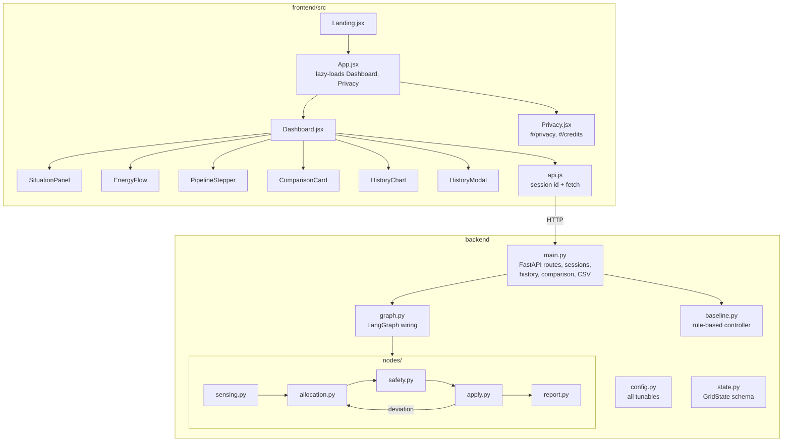
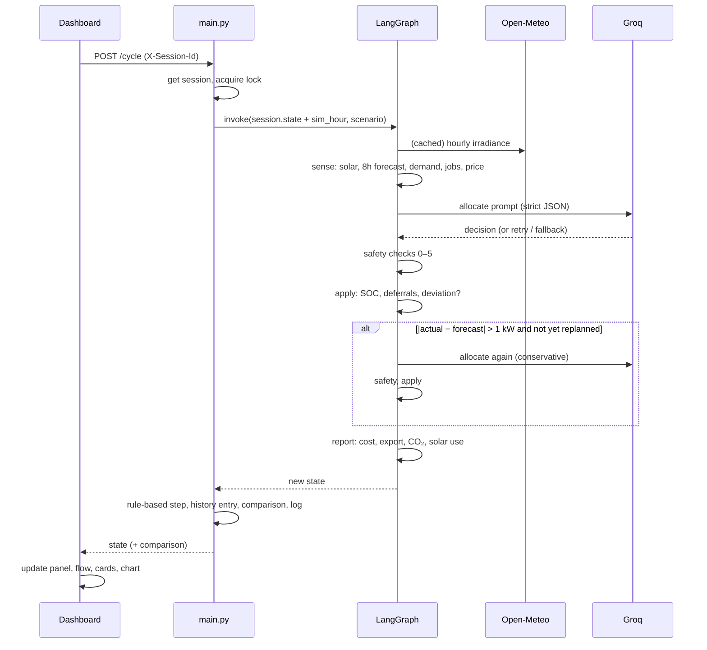

# Surya Saarthi — System Architecture

| | |
|---|---|
| Version | 1.0 (MVP) |
| Principle | Keep it small: one stateless-looking web app + one Python service. No database, queue or microservices until a real need appears. |
| Related | [01-PRD](01-PRD.md) · [02-SRS](02-SRS.md) · [04-UI-UX](04-UI-UX.md) · [05-Development-Plan](05-Development-Plan.md) |

---

## 1. Context

```mermaid
flowchart LR
    V[Viewer's browser] -- HTTPS --> FE[Frontend<br/>React SPA on Vercel]
    FE -- JSON over HTTPS<br/>X-Session-Id header --> BE[Backend<br/>FastAPI on Render]
    BE -- hourly irradiance --> OM[(Open-Meteo<br/>weather API)]
    BE -- allocation prompt --> GQ[(Groq API<br/>gpt-oss-20b)]
    OP[Operator] -. env vars, config.py, logs .-> BE
```

Two deployable units, two external services. No database.

## 2. Tech stack

| Layer | Choice | Why |
|---|---|---|
| Frontend | React 19, Vite 8, Tailwind CSS 4, Base UI / shadcn-style components | Fast static build; component primitives with accessible defaults |
| Visuals | Hand-written SVG (energy flow, chart, gauge); three.js + simplex-noise for landing backgrounds only (lazy-loaded) | No chart library needed for three series; heavy visuals kept off the critical path |
| Backend | Python 3.11+ , FastAPI, Uvicorn | Simple typed HTTP API; sync endpoints run in a thread pool |
| Agent orchestration | LangGraph (`StateGraph`) | Makes the sense → allocate → safety → apply → (replan) → report loop explicit, including the conditional back-edge |
| LLM client | `langchain-groq` → Groq `openai/gpt-oss-20b`, strict JSON schema, `reasoning_effort=low` | Fast, low-cost inference; schema-constrained output |
| Weather | Open-Meteo forecast API (no key) | Free, real irradiance, 8-day horizon |
| State | In-process memory, one `Session` object per browser tab | MVP demo needs no persistence; avoids operating a DB |
| Hosting | Vercel (frontend, static), Render (backend, long-running web service) | Backend keeps in-memory state, so it needs a long-running process, not serverless |
| Tests | Plain Python test scripts (offline + live) | Zero extra tooling; runnable anywhere |

## 3. Components



| Component | Responsibility | Key rules |
|---|---|---|
| `config.py` | Single source of every tunable: time step, reserve, rates, tariff, export, CO₂ factor, model, scenarios, site | Change behaviour here, not in node code |
| `state.py` | `GridState` TypedDict. LangGraph drops keys not declared here | Add a field here before any node returns it |
| `nodes/sensing.py` | Irradiance fetch/cache/refresh, forecast + noise, demand profile, flexible-job arrival and carry-over, tariff | Deterministic except demand/cloud noise |
| `nodes/allocation.py` | Build prompt, call LLM with retry, extract + validate JSON, fallback | Never trusted — output always goes to safety |
| `nodes/safety.py` | Checks 0–5 (SRS FR-SF0–SF8) | Pure function of state; fully unit-tested offline |
| `nodes/apply.py` | Update SOC, mark deferrals, detect forecast deviation, decide replan (max once) | |
| `nodes/report.py` | Per-cycle cost, export credit, savings, CO₂, solar accounting | |
| `baseline.py` | Fixed-rule controller on identical inputs | Must stay "fair": same limits and export as the agent |
| `main.py` | Routes, per-session state + locks + LRU, history entries, comparison summary, CSV/text export, server log | Only place with global state (`_sessions`) |
| `api.js` | Per-tab session id (`sessionStorage`), `apiFetch`, error messages | All frontend HTTP goes through here |

## 4. Data flow — one cycle



**Simulation** in the dashboard = `POST /reset` then N × `POST /cycle` (one HTTP request per hour, so no request is long-running). `POST /simulate` runs the same loop server-side for scripts (`run_scenarios.py`).

## 5. API

Base URL = backend origin. All endpoints accept optional `X-Session-Id`; download endpoints also accept `?session=`.

| Method | Path | Body | Returns |
|---|---|---|---|
| GET | `/health` | — | `{"status":"ok"}` |
| GET | `/scenarios` | — | `{"scenarios": {key: label}, "default": "normal"}` |
| GET | `/state` | — | Current `GridState` + `comparison` (empty `{}` for a new session) |
| POST | `/cycle` | — | New `GridState` after one hour |
| POST | `/reset` | `{"scenario"?: str}` | `{"status":"reset","scenario":…}` |
| POST | `/simulate` | `{"scenario": str, "days": 1–7}` | `{scenario, days, hours_run, summary{…, vs_rule_based}, cycles[], final_state}` |
| GET | `/history` | — | `{"cycles": [CycleEntry…]}` |
| GET | `/history/csv` | — | `text/csv` attachment |
| GET | `/history/download` | — | `text/plain` log attachment |

Error convention (target, SRS FR-API6/7): `400` invalid input, `404` nothing to download, `500` unexpected; body `{"error": "message"}`.

## 6. Authentication and sessions

- **No accounts in the MVP** (public demo). Isolation is by an unguessable per-tab UUID.
- Session store: `OrderedDict` of `Session` objects, max 100, LRU eviction; each has a `threading.Lock` so requests for one session run one at a time.
- Requests without an id share `default` (scripts, curl).
- **If real hardware is ever controlled:** add operator login (e.g. OAuth or signed API tokens) in front of write endpoints; keep read-only views public. This is a gate to add, not a redesign.

## 7. Storage

| Data | Where | Lifetime |
|---|---|---|
| Session state + history | Process memory | Until restart or LRU eviction |
| Irradiance cache | Process memory | Refreshed at run start if > 6 h old |
| Server log | `backend/logs/surya_saarthi_log.txt` | Append-only on disk (ephemeral on Render free tier) |
| Saved demo results | `backend/sample_results/*.json` | In git |
| Secrets | Environment (`GROQ_API_KEY`) | Host settings; `.env` locally (git-ignored) |

**When to add a database:** only when history must survive restarts or be shared across instances (e.g. a real pilot). Then: SQLite for a single instance, Postgres for more — storing `CycleEntry` rows keyed by session/site and hour. Nothing else needs to change.

## 8. Security

- Secrets only in env; never returned by the API or logged.
- Input sanitisation: session id regex; scenario and days validated; no user input reaches the filesystem path or a shell.
- LLM output is untrusted: schema-constrained, validated, and always passed through the safety layer.
- CORS: `*` for the demo → restrict to the Vercel origin for production (`allow_origins=[FRONTEND_URL]`).
- Dependencies pinned; `npm audit` / `pip-audit` before release.
- Planned: per-session rate limit on `/cycle` and `/simulate` to protect the Groq quota.
- Privacy: the browser only talks to the site and the backend (fonts self-hosted; no cookies or analytics). Groq receives simulated numbers only; Open-Meteo receives the fixed site coordinates. The cycle log file holds no session id or IP. Details on the in-app Privacy & Disclaimer page.

## 9. Deployment

| Unit | Host | Build / start | Config |
|---|---|---|---|
| Frontend | Vercel | `npm ci && npm run build` → `dist/` | `VITE_API_URL=https://<backend>.onrender.com` |
| Backend | Render web service (Python) | `pip install -r requirements.txt` · `uvicorn main:app --host 0.0.0.0 --port $PORT` · root dir `backend` | `GROQ_API_KEY`, `PYTHON_VERSION=3.12` |

Release steps: merge to `main` → Vercel and Render auto-deploy → smoke test (`/health`, one `/cycle`, dashboard loads) → run offline tests locally beforehand.

Free-tier notes: Render sleeps after inactivity (~50 s cold start) — open `/health` before a demo or add an external keep-alive ping; in-memory sessions reset on each deploy/restart.

## 10. Monitoring

Kept deliberately light for the MVP:
- **Health:** `/health` checked by Render; optional external uptime ping.
- **Logs:** Uvicorn access log + `ALLOCATION ERROR` tracebacks in the Render log stream; per-cycle entries in `surya_saarthi_log.txt`.
- **Product signals already computed per run:** `ai_fallback_hours`, `safety_override_hours`, replans. A rising fallback count means API or quota trouble.
- Next step if needed: structured JSON logs and a simple counter endpoint (`/metrics`) — not a full observability stack.

## 11. Scalability

| Need | Approach |
|---|---|
| More concurrent viewers | Already isolated per session; one instance handles demo traffic. The bottleneck is the Groq rate limit, not the server. |
| Longer / heavier runs | Paid Groq tier or a different hosted model via `config.LLM_MODEL`; keep one request per hour of simulation. |
| Multiple instances | Move `_sessions` to Redis or a DB (sticky sessions as an interim step). |
| Real sites | Add a **device interface** behind `sensing` (read meter/inverter) and after `apply` (send setpoints): `SimulatedDevice` today, `ModbusDevice`/`MqttDevice` later. The agent, safety layer and API are unchanged. |
| Multi-site coordination | One session per site plus a coordinator process sharing forecasts/surplus — post-MVP. |

## 12. Decisions log

| Decision | Alternative rejected | Reason |
|---|---|---|
| In-memory sessions | Database | Demo only; no persistence requirement; less to operate |
| Safety layer after the LLM | Rely on prompt instructions | Prompts are not guarantees; rules are testable |
| Dashboard loops `/cycle` | Single long `/simulate` call | Live progress; avoids host HTTP timeouts |
| Rule-based baseline inside the backend | Offline comparison script only | Comparison visible live, on identical inputs |
| Hand-written SVG charts | Chart library | Three series; smaller bundle |
