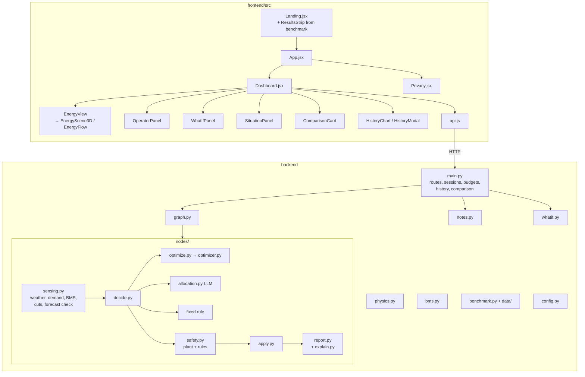

# Surya Saarthi — System Architecture

| | |
|---|---|
| Version | **v2** (27 Sep 2026) |
| Principle | Keep it small: one static web app + one Python service. No database, queue or microservices until a real need appears. |
| Related | [01-PRD](01-PRD.md) · [02-SRS](02-SRS.md) · [04-UI-UX](04-UI-UX.md) · [06-Roadmap](06-Roadmap.md) · [07-Benchmark-Results](07-Benchmark-Results.md) |

---

## 1. Context

```mermaid
flowchart LR
    V[Viewer's browser] -- HTTPS --> FE[Frontend<br/>React SPA on Vercel]
    FE -- JSON over HTTPS<br/>X-Session-Id header --> BE[Backend<br/>FastAPI on Render]
    BE -- irradiance + temperature --> OM[(Open-Meteo<br/>weather API)]
    BE -- AI mode prompts,<br/>operator notes --> GQ[(Groq API<br/>gpt-oss-20b)]
    DEV[Site controller<br/>future] -. GET /plan<br/>signed, API key .-> BE
    OP[Operator] -. env vars, config.py, logs .-> BE
```

Two deployable units, two external services, one future device interface. No database.

## 2. Tech stack

| Layer | Choice | Why |
|---|---|---|
| Frontend | React 19, Vite 8, Tailwind CSS 4, Base UI / shadcn-style components | Fast static build; accessible primitives |
| Visuals | **three.js 3D energy scene** (dashboard, lazy-loaded); hand-written SVG (flat fallback, chart, gauge); three.js + simplex-noise landing backgrounds | 3D where it helps understanding; SVG where it's lighter |
| Backend | Python 3.12, FastAPI, Uvicorn | Simple typed HTTP API |
| Orchestration | LangGraph `StateGraph` | Explicit pipeline, one pass per hour |
| Optimizer | SciPy `milp` (HiGHS) | Exact 24 h mixed-integer plans in tens of ms; no extra dependency |
| LLM | `langchain-groq` → Groq `openai/gpt-oss-20b`, strict JSON schema | AI mode and operator notes |
| Weather | Open-Meteo forecast (live); Historical Weather + Previous Runs APIs (benchmark data) | Free, real data, real forecast errors |
| State | In-process memory, one `Session` per browser tab | Demo needs no persistence |
| Hosting | Vercel (frontend), Render (backend, long-running) | In-memory state needs a long-running process |
| Tests | Plain Python scripts (offline + live); Playwright checks run from a scratch folder | Zero extra tooling in the repo |

## 3. Components



| Component | Responsibility | Key rules |
|---|---|---|
| `config.py` | Every tunable: site, battery, genset, tariff, export, CO₂, physics, BMS thresholds, AI model, demo limits, plan horizon | Change behaviour here, not in node code; placeholders marked |
| `state.py` | `GridState` TypedDict | LangGraph drops undeclared keys — declare first |
| `physics.py` | PV output (losses, heat, clipping), battery SOC with efficiency, wear cost, state of health, diesel fuel | Shared by every controller |
| `bms.py` | Live charge/discharge limits, temperature derating/cut-off, alarms, injected faults | Safety obeys it |
| `nodes/sensing.py` | Live or recorded weather, 24 h forecast (optional correction), demand + jobs, power cuts, BMS, price, forecast check | Noise keyed on (seed, hour) |
| `nodes/decide.py` | Dispatch to optimizer / AI / fixed rule | `controller` field in state |
| `optimizer.py`, `nodes/optimize.py` | 24 h MILP mirroring the plant; first hour applied (MPC); facts for explanations | Its plans pass safety unchanged (tested) |
| `nodes/allocation.py` | LLM prompt, retry, JSON validation; fixed-rule fallback; honours the AI budget | Never trusted |
| `nodes/safety.py` | Plant model + hard rules for every controller, including power cuts and genset | Pure function of state |
| `nodes/apply.py` | Battery update (once), health, deferrals | Exactly once per hour |
| `nodes/report.py`, `explain.py` | Cost incl. wear + diesel, CO₂, savings vs no solar/battery; EN/HI explanation from applied numbers | Explanation written after safety |
| `notes.py` | Operator notes → validated actions (LLM schema, rule fallback) | Confirm before apply |
| `whatif.py` | 24 h replays with changes; optimizer vs fixed rule | No AI calls, session untouched |
| `benchmark.py`, `data/` | Recorded-weather benchmark; writes results + landing summary | Seeded, reproducible |
| `main.py` | Routes, sessions (LRU 100), seeds, controllers, constraints, AI budgets, rate limit, CORS, fixed-rule baseline through the same graph, history, CSV, `/plan` signing | Only global state: `_sessions`, `_ai_hours_all_sessions` |
| `EnergyScene3D.jsx` / `EnergyView.jsx` / `webgl.jsx` | 3D scene, fallback to flat SVG, WebGL check + error boundary | Never crash the page |

## 4. Data flow — one hour

```mermaid
sequenceDiagram
  participant UI as Dashboard
  participant API as main.py
  participant GR as LangGraph
  participant LLM as Groq
  UI->>API: POST /cycle (X-Session-Id)
  API->>API: session lock; inputs = seed, hour, cuts, targets, DR, fault
  API->>GR: invoke(controller state)
  GR->>GR: sense: weather, forecast, demand, BMS, price, forecast check
  alt optimizer (default)
    GR->>GR: 24 h MILP, first hour
  else AI mode and budget left
    GR->>LLM: prompt (strict JSON)
    LLM-->>GR: decision (or retry / fixed-rule fallback)
  else fixed rule
    GR->>GR: solar → battery → grid/genset
  end
  GR->>GR: safety + BMS (plant model) → apply → report + explanation
  GR-->>API: state
  API->>GR: same inputs, controller = fixed (baseline, own battery)
  GR-->>API: baseline state
  API->>API: history entry, comparison, log
  API-->>UI: state (+ comparison)
```

**Simulation** in the dashboard = `POST /reset` (`keep_constraints`) then N × `POST /cycle`. `POST /simulate` runs the loop server-side for scripts.

## 5. API

All endpoints accept optional `X-Session-Id`; downloads and `/plan` also accept `?session=`. Errors: `{"error": "message"}` (400 invalid input, 401 bad device key, 404 nothing to download yet, 429 rate limit, 503 no plan).

| Method | Path | Body | Returns |
|---|---|---|---|
| GET | `/health`, `/scenarios`, `/state`, `/history`, `/constraints` | — | status / scenarios / state / cycles / active constraints |
| POST | `/cycle` | — | State after one hour |
| POST | `/simulate` | `{scenario, days 1–7, seed?, controller?}` | Summary + cycles |
| POST | `/reset` | `{scenario?, seed?, controller?, keep_constraints?}` | `{status, scenario, seed, controller}` |
| POST | `/controller` | `{controller: optimizer\|ai\|fixed}` | `{controller}` |
| POST | `/note/interpret` | `{text}` | `{actions, source, summary_en, summary_hi}` (changes nothing) |
| POST | `/note/apply` | `{actions}` | Active constraints |
| POST | `/constraints/clear` | `{kind?}` | Active constraints |
| POST | `/bms/fault` | `{fault: overtemp\|sensor_lost\|null}` | Active constraints |
| POST | `/whatif` | `{solar_scale?, battery_health_pct?, peak_multiplier?, extra_load_kw?, outage?, dr?}` | `{now, what_if, what_if_rule}` hourly + totals |
| GET | `/plan` | — (`X-Api-Key` if configured) | 24 h schedule (+ HMAC-SHA256 signature if configured) |
| GET | `/history/csv`, `/history/download` | — | CSV / text log |

## 6. Authentication and sessions

- Public demo, no accounts. Isolation by an unguessable per-tab id; LRU of 100 sessions, one lock each.
- `/plan` can require `X-Api-Key` (`DEVICE_API_KEY`) and be signed (`PLAN_SIGNING_KEY`).
- **Before controlling real hardware:** operator login on write endpoints; the device verifies signatures and keeps its own safety rules.

## 7. Storage

| Data | Where | Lifetime |
|---|---|---|
| Sessions, history, constraints | Process memory | Until restart / eviction |
| Weather cache (live) | Process memory | Downloaded again at run start if > 6 h old; each run keeps the download it started with (last 8 kept) |
| Recorded weather | `backend/data/weather_delhi.json` | In git (CC BY 4.0) |
| Benchmark results | `backend/sample_results/benchmark.json`, `frontend/src/data/results-summary.json` | In git |
| Server log | `backend/logs/` | Append-only, git-ignored |
| Secrets | Environment / `.env` (git-ignored) | Host settings |

## 8. Security and privacy

- Secrets only in env; LLM output untrusted (schema, validation, safety layer).
- Operator notes: validated (time windows ≤ 12 h within 48 h, targets within reserve–100%, caps 0–20 kW), confirmed by the user; the LLM never commands a device.
- Demo protection: AI hours per rolling 24 h (whole demo and per tab), per-tab request limit (429), `FRONTEND_ORIGINS` for CORS.
- Privacy: no cookies/analytics; fonts self-hosted; Groq receives simulated numbers (AI mode) and the text of operator notes; Open-Meteo receives the fixed site coordinates. Stated on the Privacy page.

## 9. Deployment

| Unit | Host | Build / start | Config |
|---|---|---|---|
| Frontend | Vercel | `npm ci && npm run build` | `VITE_API_URL` |
| Backend | Render (Python 3.12) | `pip install -r requirements.txt` · `uvicorn main:app --host 0.0.0.0 --port $PORT` · root `backend` | `GROQ_API_KEY`, `FRONTEND_ORIGINS`, `AI_HOURS_PER_DAY`, optional `DEVICE_API_KEY`, `PLAN_SIGNING_KEY` |

v2 is not deployed yet (needs the GitHub decision).

## 10. Scalability

| Need | Approach |
|---|---|
| More viewers | Sessions isolated; the optimizer needs no AI calls, so the Groq limit only affects AI mode |
| Multiple instances | Move `_sessions` to Redis or a DB |
| Real sites | A device adapter reads meters/inverters into sensing and follows `/plan` with local safety rules (Modbus/MQTT) |
| Multi-site | One session per site + a coordinator (not built) |

## 11. Decisions log

| Decision | Alternative rejected | Reason |
|---|---|---|
| Optimizer decides by default; AI for language | LLM decides | Benchmark: optimizer cheaper, 0 overrides; the LLM needed overrides in 8–9 of 24 hours |
| Baseline runs through the same graph | Separate baseline formula | Fair by construction; AI-off run == baseline (tested) |
| Forecast check before deciding | Loop back after apply | The loop applied the battery twice in one hour |
| Explanation written after safety | Explain the plan | Can't describe something that didn't happen |
| Forecast correction off | On | Measured: helps one season, hurts three |
| 3D scene with flat fallback | 3D only | Must work without WebGL and with reduced motion |
| In-memory sessions | Database | Demo only |
