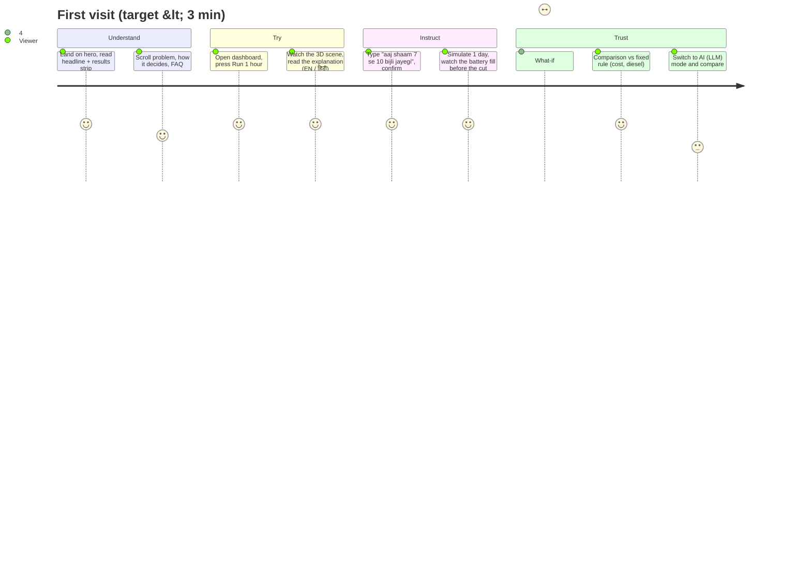

# Surya Saarthi — UI/UX Document

| | |
|---|---|
| Version | **v2** (27 Sep 2026) |
| Audience | Frontend developers and designers working in `frontend/src` |
| Related | [01-PRD](01-PRD.md) · [02-SRS](02-SRS.md) · [03-Architecture](03-Architecture.md) · [06-V2-Roadmap](06-V2-Roadmap.md) |

Status tags: **Done** = in the current build · **Planned** = not built.

---

## 1. Design principles

1. **Show why, not just what.** Every decision sits next to the inputs that caused it and a plain explanation — in English or Hindi.
2. **Safety is visible.** When a rule, the BMS or a power cut changes what happens, say so in plain words.
3. **Honest numbers.** Every figure names its baseline ("vs fixed rule", "vs no solar or battery"); simulated inputs and placeholder prices are labelled; landing numbers come only from the benchmark file.
4. **One primary action per screen.** Landing → *See it decide*. Dashboard → *Run 1 hour* (or *Simulate N days*).
5. **Calm, technical, dark.** Colour is reserved for energy sources and status (solar amber, battery teal, grid red, genset violet).
6. **Plain language, two languages.** "Sunlight", "battery", "power cut", "grid price"; explanations and panels available in Hindi.
7. **Never break.** No WebGL → flat diagram; reduced motion → still scene; AI unavailable → fixed rule, labelled.

## 2. User journey (demo viewer)



## 3. Information architecture

```
Landing (/)                                   Dashboard (same URL, view state)
├─ Nav: brand · GitHub · Open dashboard        ├─ Header: brand · [scenario · days · Simulate N days]
├─ Hero + CTA "See it decide"                  │          · ← Overview · History report · Reset session · Run 1 hour
├─ Results strip (from benchmark)              ├─ Progress bar / simulation-complete banner
├─ The problem (ToD prices, power cuts)        ├─ Intro: H1, "Decides:" switch, language switch, stepper
├─ How it decides (6 stages)                   ├─ Situation panel (time, sunlight, grid price / power cut, demand)
├─ What it manages (6 cards)                   ├─ Legend + 3D energy scene (flat fallback) + deferred jobs
├─ Who it's for (3 cards)                      ├─ Explanation quote (+ forecast-missed badge)
├─ Statement: "It plans. It explains…"         ├─ Cards: Battery (gauge + BMS) · Safety & power-cut events · Session impact
├─ FAQ (7)                                     ├─ Operator panel · What-if panel
├─ Live-demo CTA                               ├─ Comparison vs fixed rule (+ CSV)
└─ Footer: SIH · SDG 7 · Open-Meteo ·          ├─ Power-mix history chart · History report (modal)
   GitHub · Privacy · Credits                  └─ Footer: pipeline · Open-Meteo · Privacy

Privacy & Disclaimer (#/privacy; #/credits scrolls to Credits & licences)
```

`App.jsx` picks the view from the URL: none = landing, `#/dashboard`, `#/privacy` and `#/credits` (Privacy page; Back returns to where it was opened). Skip links move focus instead of changing the hash. Dashboard, Privacy and the 3D scene are lazy-loaded.

## 4. Screens

### 4.1 Landing — Done
| Section | Content |
|---|---|
| Hero | H1 "The sun doesn't send an invoice. Many microgrids waste it anyway."; sub-line (solar, battery, grid and diesel planned together; English or Hindi); CTA *See it decide →*; WebGL background only if WebGL exists and motion is allowed |
| Results strip | From `results-summary.json` (`benchmark.py`): % lower cost grid normal; % lower with a daily 3-hour cut; diesel optimizer vs fixed rule; safety overrides; note: simulated, recorded Delhi weather, illustrative cuts, placeholder prices |
| The problem | Fixed rules, ToD prices (at least 20% cheaper in solar hours, peak 10–20% costlier by state; we assume 20%), power cuts → genset |
| How it decides | Sense · Check forecast · Decide · Safety and battery limits · Apply · Explain and report |
| What it manages | Solar panels · Battery · Grid · Diesel genset · Water pump · EV charging |
| Who it's for | Homes with solar and backup · Schools, clinics and small businesses · Village and farm mini-grids |
| Statement | "It plans. It explains. It cannot override the safety rules." + optimizer/AI roles |
| FAQ | Real data? · Why an optimizer and an AI? · Better than today's controllers? (numbers from the benchmark file) · Wrong decision? · Internet? · Cost? · Real equipment? |
| Footer | SIH line, SDG 7, Open-Meteo attribution, GitHub, Privacy, Credits |

### 4.2 Dashboard — Done
| Region | Content | Behaviour |
|---|---|---|
| Header | Simulate-days group, Overview, History report, Reset session, *Run 1 hour* | "More" menu below 640 px |
| Intro | H1 "Every hour, it plans the next 24."; **Decides:** Optimizer / AI (LLM) / Fixed rule (radiogroup, one-line description of the mode); **English / हिंदी** (radiogroup, remembered in localStorage); stepper Sense → Decide → Safety check → Apply → Report | Controller switches from the next hour |
| Situation panel | Time · Sunlight (vs forecast; red when missed) · Grid price, or **Power cut** with genset kW · Demand (essential, jobs running/waiting) | 2 columns on phones |
| 3D energy scene | Solar array + sun · battery cabinet (charge bar) · transmission tower · diesel genset · house; particle flows; HTML labels (name, value, sub-line) | See §6.1 |
| Explanation | Quote in the chosen language (Hindi only in optimizer mode; note otherwise); forecast-missed badge | |
| Cards | **Battery**: gauge + health, temperature, charge/discharge limits · **Safety and power-cut events** · **Session impact** (₹ saved vs no solar or battery; CO₂) | |
| Operator panel | Note input + examples → interpretation (EN/HI, "Read by the AI / rule-based parser") → Apply / Cancel; active constraints with Clear; BMS test buttons (overheating, lost sensor, clear) | Nothing applies until confirmed |
| What-if panel | Sun %, battery health %, evening peak price, extra load, power cut (from/to), DISCOM limit (from/to/max) → table Now / What-if (optimizer) / What-if (fixed rule) × cost (change in battery charge counted), grid, diesel, unserved, lowest battery; battery-level chart | No AI calls |
| Comparison | Grid bars; % less grid, ₹ saved vs fixed rule (incl. wear, diesel), renewable share, overrides / AI fallback; solar row; power-cut hours, diesel, unserved, battery wear; CSV | |
| History | Chart (last 20 hours) and modal log | |

### 4.3 Privacy & Disclaimer — Done
What is stored · What is sent where (Groq: simulated numbers in AI mode and the text of operator notes; Open-Meteo: site coordinates) · No cookies/tracking · Simulation disclaimer · No warranty · Credits & licences (incl. SciPy/NumPy/HiGHS, three.js, fonts, icons, adapted components).

## 5. Key user flows

**F1 — Run one hour:** *Run 1 hour* → stepper animates → state arrives → scene, panel, explanation, cards update.

**F2 — Tell it about a power cut:** type note → *Understand* → check interpretation → *Apply* → constraint listed → run or simulate; battery fills before the cut; genset runs only if needed.

**F3 — Simulate:** *Simulate N days* resets (keeping constraints at the same time of day) and runs N × 24 hours with live progress.

**F4 — What-if:** set changes → *Run what-if* → table and chart; session unchanged.

**F5 — Compare controllers:** switch *Decides:* and run the same hours; the comparison card always compares against the fixed rule.

**F6 — Test safety:** *Simulate overheating* → next hour the battery is isolated and the events card says why → *Clear fault*.

## 6. Components

| Component | File | Notes |
|---|---|---|
| EnergyView | `EnergyView.jsx` | Chooses 3D or flat; screen-reader summary (`role="img"`); deferred-jobs strip |
| EnergyScene3D | `EnergyScene3D.jsx` | three.js scene; props: hour, solarGenKw, solarKw, batteryKw, gridKw, exportKw, gensetKw, unservedKw, gridAvailable, loadKw, socPct |
| EnergyFlow | `EnergyFlow.jsx` | Flat SVG fallback (genset replaces grid in a cut) |
| webgl helpers | `webgl.jsx` | `hasWebGL()`, `FallbackBoundary` |
| OperatorPanel | `OperatorPanel.jsx` | `lang` |
| WhatIfPanel | `WhatIfPanel.jsx` | `lang` |
| SituationPanel | `SituationPanel.jsx` | `state`, `decision`, `scenarioLabel` |
| ComparisonCard | `ComparisonCard.jsx` | `comparison`, `csvUrl` |
| PipelineStepper, HistoryChart, HistoryModal, ConfirmDialog, MoreMenu | as named | |
| UI primitives | `components/ui/*` | Base UI / shadcn-style; links via `render={<a/>}` |

### 6.1 3D energy scene
- View: fixed, gently tilted, no perspective and no camera motion, so it reads like a clear diagram. No shadows or glow effects.
- Layout: solar array (left), tower (back-centre, wires leaving the scene), battery cabinet (centre, charge bar), genset (front-left, its label below it), house (right). Nothing overlaps on desktop or phone.
- Time of day (from the simulated hour): sky gradient night → dawn → bright day → dusk → night; the ground lightens by day; the sun crosses from left (morning) to right (evening) and its glow grows with solar output; a moon at night. Corner chip: "☀ 13:00 · day" / morning / evening / "☾ night".
- Flows: only lines that carry power are drawn (solar, battery, grid, genset to the house, plus solar→battery, solar→grid export, genset→battery); lighter dots move along them, more and faster with more kW.
- States: power cut = dark tower, blinking red beacon, genset smoke and a green lamp; unserved load = flickering windows; house windows lit by the power it gets.
- Labels are HTML (crisp, themed), positioned from the 3D anchors every frame, above the canvas.

## 7. Interactions and motion

- Count-up numbers (600 ms) and landing reveals; all off with reduced motion.
- 3D scene: continuous animation normally; with reduced motion a single still render per update; paused when off-screen or the tab is hidden.
- Tooltips on the header actions (200 ms).

## 8. Forms and inputs

| Control | Rules |
|---|---|
| Scenario select, days | Labelled (`#scenario-select`, `#sim-days`); days 1–7 |
| Controller, language | `role="radiogroup"` with `role="radio"` buttons and `aria-checked` |
| Operator note | Labelled `#operator-note`; ≤ 300 chars; example chips fill it |
| What-if | Labelled sliders, selects and checkboxes; server validates ranges |

## 9. States

| Region | Loading | Empty | Error |
|---|---|---|---|
| Dashboard | Stepper animates | "Nothing has run yet…" | Red banner with the server's message (e.g. rate limit) |
| 3D scene | Flat diagram while loading | — | Flat diagram (no WebGL / failure) |
| Operator panel | Button "…" | "No power cuts, targets or grid limits set." | Message under the input (e.g. "Couldn't find a power cut…") |
| What-if | "Running…" | Controls only | Message under the button |
| Events card | — | "Nothing to report — the plan stayed within every limit." | — |

## 10. Responsive behaviour

| Width | Behaviour |
|---|---|
| ≥ 1024 px | Operator and what-if panels side by side; 3D scene up to 1040 px wide |
| < 1024 px | Panels stack |
| < 640 px | Header "More" menu; 3D scene 4:3.6 with smaller labels (sub-lines hidden) |
| 390 px | No horizontal scroll (verified) |

## 11. Accessibility

- Semantic controls; radiogroups for the switches; labelled inputs; visible focus ring.
- 3D scene: canvas `aria-hidden`; the wrapper has a one-sentence summary of the power flows; labels duplicate text visually only.
- Reduced motion respected everywhere (landing backgrounds skipped, still 3D scene).
- Body text contrast ≥ 4.5:1; colour never the only signal (power cut, BMS and overrides are text).
- Hindi text marked `lang="hi"` on the explanation.

## 12. Visual design

| Token | Value | Use |
|---|---|---|
| `--background` | `#0e0f10` | Page |
| `--card` | `#16181a` | Cards |
| `--foreground` | `#f2f0ec` | Primary text |
| `--muted-foreground` | `#8b8f94` | Secondary text |
| `--solar` | `#ffb648` | Solar, export |
| `--battery` | `#4fd8c4` | Battery, positive results, focus |
| `--grid` | `#ff6b5c` | Grid import, peak price, errors, power cut |
| `--genset` | `#b99cff` | Diesel genset |

Fonts: Space Grotesk (display), Inter (body), JetBrains Mono (labels) — self-hosted via Fontsource (OFL 1.1).

## 13. Copy guidelines

- Say what happened and why ("Storing 3.1 kW of spare sunshine… Why: planning to have the battery at about 100% when the power cut starts at 19:00").
- Always name the baseline for a saving.
- "Essential load", "flexible jobs", "power cut", "genset", "sunlight".
- Label simulated inputs, illustrative cuts and placeholder prices.
- Hindi: simple, everyday words (बिजली कटौती, बैटरी, जनरेटर, धूप).
