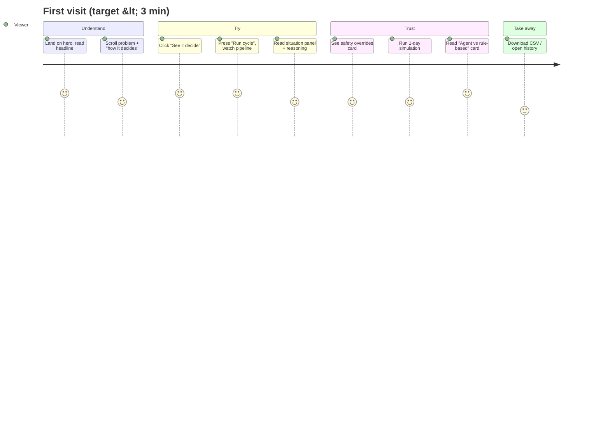

# Surya Saarthi — UI/UX Document

| | |
|---|---|
| Version | 1.0 (MVP) |
| Audience | Frontend developers and designers working in `frontend/src` |
| Related | [01-PRD](01-PRD.md) · [02-SRS](02-SRS.md) · [03-Architecture](03-Architecture.md) · [05-Development-Plan](05-Development-Plan.md) |

Status tags: **Done** = in the current build · **Planned** = to build for MVP.

---

## 1. Design principles

1. **Show why, not just what.** Every decision is shown next to the inputs that caused it (time, sun, price, demand) and the agent's one-sentence reason.
2. **Safety is visible.** When a hard rule overrides the AI, say so in plain words. "No overrides" is also shown.
3. **Honest numbers.** Every figure has a baseline ("vs grid-only", "vs rule-based") and simulated inputs are labelled.
4. **One primary action per screen.** Landing → *See it decide*. Dashboard → *Run cycle* (or *Run simulation*).
5. **Calm, technical, dark.** Low-chrome dark UI; colour is reserved for energy sources and status.
6. **Plain language for non-experts.** Prefer "sunlight", "battery", "grid price" over jargon; technical terms (LangGraph, SOC) stay in docs, not headlines.

## 2. User journey (demo viewer)



## 3. Information architecture and navigation

```
Landing (/)                       Dashboard (same URL, view state)
├─ Nav: brand · GitHub · Open dashboard      ├─ Header: brand · scenario · days · Run simulation
├─ Hero + CTA "See it decide"                │          · ← Overview · History report · Reset session · Run cycle
├─ Results strip (hidden until data)                ├─ Simulation progress bar (while running)
├─ The problem                               ├─ Intro + pipeline stepper
├─ How it decides (6 stages)                 ├─ Situation panel
├─ What it manages                           ├─ Energy flow + deferred jobs strip
├─ Who it's for                              ├─ Reasoning quote (+ "Replanned" badge)
├─ Safety statement                          ├─ Cards: Battery reserve · Safety overrides · Session impact
├─ Live-demo CTA                             ├─ Agent vs rule-based card (+ CSV link)
└─ Footer: loop · SDG 7 · GitHub             ├─ Power-mix history chart
                                             └─ History report (modal)
```

Single-page app; `App.jsx` switches `landing` ↔ `dashboard`. The dashboard is lazy-loaded. Browser back does not switch views (acceptable for MVP; Planned: hash route `#/dashboard` so links and back work). Each view sets its own page title ("Surya Saarthi — AI for solar microgrids" / "Dashboard · Surya Saarthi"). Both views start with a keyboard-only "Skip to content" link. Link previews use `public/og-image.png` (1200×630) via Open Graph / Twitter tags in `index.html`.

## 4. Screens

### 4.1 Landing — Done
| Section | Content | Notes |
|---|---|---|
| Nav (sticky) | Brand dot + "Surya Saarthi" (name, tagline, SIH ID and team name live in `src/brand.js`); *GitHub* (ghost); *Open dashboard* (outline) | Backdrop blur, hairline bottom border |
| Hero | Badge "SDG 7 · Affordable & Clean Energy"; H1 "The sun doesn't send an invoice. Most microgrids waste it anyway."; plain-language sub-line; liquid-glass CTA *See it decide →*; scroll cue | WebGL background at 60% opacity (lazy, hidden for reduced motion) |
| Results strip | 4 tiles from `src/data/results-summary.json` (written by `run_scenarios.py`): cost reduction range, grid reduction range, ₹ saved/day vs rules, essential-load outages; note line with method | Hidden while the summary has no scenarios, so unvalidated numbers never show |
| The problem | Eyebrow, H2 statement, two paragraphs (PM Surya Ghar; 2023 ToD rules) | |
| How it decides | Six numbered rows: Sense, Allocate, Safety limits, Apply, Replan, Report | Reveal on scroll |
| What it manages | Five small cards: Solar, Battery, Grid (import/export), Water pump, EV charging | Icon + one line each |
| Who it's for | Three cards: Rooftop homes (PM Surya Ghar), Campuses, Village/farm microgrids | |
| Safety statement | "It can reason. It cannot override a 20% reserve." + paragraph | Centered |
| FAQ ("Questions judges ask") | Six native `<details>` items: real data?, AI mistakes?, internet?, better than today?, cost?, real equipment? | Keyboard-accessible, + / × indicator |
| Live-demo CTA | Eyebrow, H2, *Start live session →* over animated waves | Dark radial panel behind text for contrast |
| Footer | Loop summary; SDG 7 · Source on GitHub | Mono, small |

### 4.2 Dashboard — Done
| Region | Content | Behaviour |
|---|---|---|
| Header (sticky) | Scenario select (from `/scenarios`), days input (1–7), *Run simulation* (secondary, tooltip), *← Overview*, *History report*, *Reset session* (tooltip), *Run cycle* (primary) | Status dot: grey idle, pulsing solar while computing, battery-green when a state exists. Controls disabled while a simulation runs. |
| Progress bar | "Simulating {scenario}… i/N hours", bar, latest status line (solar, grid, replanned, reasoning) | Only while simulating |
| Intro | Badge "Live agent · SDG 7 · Clean energy", H1, sub-line, pipeline stepper, caption | Stepper: pending/active/done per stage; "↻ replanning" on Allocate |
| Situation panel | 4 tiles: **Time** (HH:00, Day n · scenario), **Sunlight** (kW now; "forecast said X kW" — red + "so it replans" when miss > 1 kW), **Grid price** (₹/kWh; band text coloured: solar hours = battery, peak = grid, normal = muted), **Demand** (essential kW; jobs running · waiting) | 2 columns on mobile, 4 on desktop |
| Legend + energy flow | Solar / Battery / Grid (last resort) legend; SVG with three source nodes, load node, animated dashed paths (width ∝ kW), solar→battery arc when charging ("kW in"), "↑ exporting X kW" under Grid | Dimmed node when ≈ 0 kW; count-up numbers |
| Deferred strip | "Deferred this cycle" + chips "ev charging (21:00) · until 06:00" | Only if any deferred |
| Reasoning | Quoted sentence; red "Replanned — forecast deviation detected" badge when applicable | |
| Cards row | **Battery reserve** (ring gauge, red ≤ 22%) · **Safety overrides this cycle** (list, or "No overrides triggered…") · **Session impact** (₹ saved vs grid-only, kg CO₂ avoided, cycles run) | 1 column mobile, 3 desktop |
| Agent vs rule-based | Two bars (agent vs rules grid kWh); stats: % less grid, ₹ saved vs rules, renewable share, overrides/AI-fallback hours; second row: solar generated, self-use % (rules in caption), exported kWh, wasted kWh; *Download results (CSV)* | Appears after the first cycle |
| History chart | Three lines (solar, battery, grid) for last 20 cycles; hover line + tooltip; ring marker on replanned cycles | |
| History modal | Newest first: cycle, timestamp, replanned badge, metrics, reasoning, alerts; *Download log (.txt)* | Scrollable, max 82vh |

## 5. Key user flows

**F1 — Run one cycle**
1. Click *Run cycle* → button shows "Computing…", stepper animates Sense → Allocate → Safety → Apply (≈ 420 ms each).
2. Response arrives → if replanned, stepper jumps back to Allocate with "↻ replanning" for ~550 ms.
3. Stepper lands on Report; all regions update; totals add this cycle.

**F2 — Run a simulation**
1. Pick scenario and days → *Run simulation*.
2. Session resets; progress bar appears; each hour updates every region live.
3. Finish → progress bar disappears; comparison card shows the full-run result.
4. Error mid-run → loop stops, error banner shows, completed hours remain.

**F3 — Refresh / return**
1. Reload the page → same tab keeps its session id → dashboard restores state, chart, totals and scenario.

**F4 — Export**
1. *Download results (CSV)* (comparison card) or *History report → Download log (.txt)*; both use `?session=` links.

**F5 — Saved results (Planned)**
1. *Load saved results* next to *Run simulation* → choose scenario → dashboard renders the pre-computed run instantly, labelled "Saved run", with no AI calls.

## 6. Components

| Component | File | Props / variants |
|---|---|---|
| Button | `components/ui/button.jsx` (Base UI) | `variant`: default, secondary, outline, ghost, destructive; `size`: sm, default; links via `render={<a/>}` + `nativeButton={false}` (never `asChild`) |
| LiquidButton | `components/ui/liquid-glass-button.jsx` | Landing CTAs only, `size="xl"` |
| Tooltip | `components/ui/tooltip.jsx` | Trigger uses `render={<Button …/>}` so no nested buttons |
| Card | `components/ui/card.jsx` | Header/Title/Description/Content |
| Badge | `components/ui/badge.jsx` | outline (mono, uppercase), destructive |
| Dialog | `components/ui/dialog.jsx` | History modal |
| PipelineStepper | `PipelineStepper.jsx` | `stepIndex` −1…4, `replanFlash` |
| SituationPanel | `SituationPanel.jsx` | `state`, `scenarioLabel` |
| EnergyFlow | `EnergyFlow.jsx` | `solarKw, batteryKw (neg = charging), gridKw, exportKw, criticalKw, flexibleLoads, loading` |
| BatteryGauge | in `Dashboard.jsx` | `pct` |
| ComparisonCard | `ComparisonCard.jsx` | `comparison`, `csvUrl` |
| HistoryChart | `HistoryChart.jsx` | `history[]` {cycle, solar, battery, grid, replanned} |
| HistoryModal | `HistoryModal.jsx` | `open`, `onOpenChange` |

## 7. Interactions and motion

- Numbers count up over 600 ms (ease-out cubic); disabled for `prefers-reduced-motion`.
- Energy-flow dashes animate only on active paths (> 0.05 kW); whole diagram dims slightly while computing.
- Landing sections fade/slide in once on scroll (0.8 s); disabled for reduced motion.
- Hover: buttons lighten; chart shows a vertical guide and tooltip for the nearest cycle.
- Tooltips on *Run simulation* and *Reset session* explain the action (200 ms delay).

## 8. Forms and inputs

| Control | Rules |
|---|---|
| Scenario select | Options from `/scenarios`; defaults to server default; disabled while simulating; option text dark on light for native dropdown readability |
| Days | Number input 1–7; clamped on change; label "day/days" pluralised |

No free-text inputs in the MVP.

## 9. States

| Region | Loading | Empty | Error |
|---|---|---|---|
| Dashboard (no session yet) | — | "No cycle has run yet. Press Run cycle to sense conditions and allocate power." | Red bordered banner with message from `errorMessage()` |
| Run cycle | Button "Computing…", status dot pulses, stepper animates | — | Banner; stepper stays; previous data kept |
| Simulation | Progress bar with hour i/N and status line | — | Banner; completed hours kept |
| Safety overrides card | — | "No overrides triggered — the proposed allocation stayed within every limit." | — |
| History chart | — | "Run a few cycles to see the trend build up here." | — |
| History modal | "Loading…" | "No cycles logged on the server yet." | "Can't reach the backend to load history." |
| Scenario list | Built-in default shown | — | Silent fallback to default |

Error copy: network → "Can't reach the backend at {URL}. Make sure uvicorn main:app is running."; HTTP error → "The backend returned an error ({status}). Check the server log."

## 10. Responsive behaviour

| Breakpoint | Behaviour |
|---|---|
| ≥ 768 px (`md`) | Situation panel 4 columns; cards row 3 columns; comparison stats 4 columns |
| < 768 px | Situation panel and comparison stats 2 columns; cards stack; header controls wrap (3 rows at 390 px) |
| 390 px (reference phone) | No horizontal scroll (verified); SVGs scale by `viewBox` |

Below 640 px the header is two rows (brand; controls) and Overview / History report / Reset session move into a **More** menu (Done; closes on outside click or Escape).

## 11. Accessibility

- Semantic buttons/links only; no nested interactive elements (verified: 0).
- Visible focus ring (`--ring` = battery green).
- Body text contrast ≥ 4.5:1 (muted `#8b8f94` on `#0e0f10` ≈ 5.8:1).
- Energy flow has `aria-label`; stepper is `role="list"`. Planned: text alternative listing kW values under the SVG for screen readers.
- Colour is never the only signal: overrides are text, replans have a badge, price band has a label.
- `prefers-reduced-motion` respected (backgrounds hidden, no count-up, no reveal).
- Hit targets ≥ 32 px high for header buttons.

## 12. Visual design

### Colours (tokens in `src/index.css`)
| Token | Value | Use |
|---|---|---|
| `--background` | `#0e0f10` | Page |
| `--card` | `#16181a` | Cards, panels, SVG nodes |
| `--foreground` | `#f2f0ec` | Primary text, primary button |
| `--muted-foreground` | `#8b8f94` | Secondary text, labels |
| `--border` | `rgba(255,255,255,0.08)` | Hairlines |
| `--secondary` | `rgba(255,255,255,0.06)` | Inputs, subtle fills |
| `--solar` | `#ffb648` | Solar values, export |
| `--battery` / `--accent` / `--ring` | `#4fd8c4` | Battery, positive results, eyebrows, focus |
| `--grid` / `--destructive` | `#ff6b5c` | Grid import, peak price, errors, replans |

### Typography
| Role | Font | Size |
|---|---|---|
| Display (H1–H3, big numbers) | Space Grotesk 500–600 | H1 `clamp(2rem, 4.5vw, 3.4rem)` dashboard / `clamp(2.2rem, 5.5vw, 4.2rem)` landing; stats 1.5rem |
| Body | Inter 400–500 | 0.95–1.1rem, line-height 1.6–1.7 |
| Labels, eyebrows, data | JetBrains Mono | 0.65–0.75rem, uppercase, tracking 0.04–0.12em |

### Spacing and shape
- Base unit 4 px (Tailwind scale). Section padding `clamp(60px, 10vw, 120px)` landing; dashboard content max-width 48rem (intro) / 72rem (cards).
- Radius `--radius` 0.75rem (cards), `rounded-lg` tiles, pills for badges and landing CTAs.
- Cards separated by 1 px hairline gaps (`gap-px` on `bg-border`).

## 13. Copy guidelines

- Say what happened and why in one sentence ("Solar is unavailable, battery supplies critical load…").
- Always name the baseline for a saving ("vs grid-only", "vs rule-based").
- Use "essential load" in UI (not "critical" in headings), "flexible jobs", "sunlight", "grid price".
- Label simulated inputs ("simulated demand profile").
