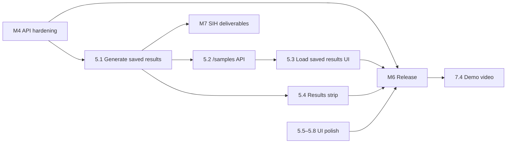

# Surya Saarthi — Development Plan

| | |
|---|---|
| Version | 1.0 |
| Branch | `sih-improvements` (merge to `main` at M6) |
| Related | [01-PRD](01-PRD.md) · [02-SRS](02-SRS.md) · [03-Architecture](03-Architecture.md) · [04-UI-UX](04-UI-UX.md) |

Most of the MVP is already built. This plan records what is done (so nobody rebuilds it), then lays out the remaining work in order, with dependencies, owners-to-assign, estimates and a Definition of Done.

---

## 1. MVP scope recap

**In MVP:** PRD features F1–F16 · SRS requirements marked Done + the Planned items FR-API6, FR-API7, FR-UI8, FR-UI9, NFR-S5 · landing additions (results strip, what it manages, who it's for) · deployment of `main` to Vercel + Render.

**Not in MVP:** hardware integration, accounts, database, multi-site, mobile apps, custom forecasting, extra languages (PRD §11).

## 2. Status of completed milestones

| Milestone | Contents | Status |
|---|---|---|
| **M0 — Setup** | Repo, FastAPI + LangGraph skeleton, React/Vite/Tailwind app, `.env` handling, Vercel/Render hosting | Done |
| **M1 — Correct simulation** | 1-hour time step; CEA 0.71 CO₂ factor; model name in config; job carry-over + deadlines; safety checks 0–5 with tolerance; savings baseline over all served load; replanning that actually triggers (forecast noise); `solar_used` semantics | Done |
| **M2 — Decision quality & reliability** | Groq retry/back-off + `reasoning_effort=low`; ToD tariff with 8 h prices; 8 h solar forecast; net-metering export; daily demand profile; weather refresh; pinned dependencies | Done |
| **M3 — Proof & visibility** | Rule-based baseline + comparison summary; CSV + text exports; situation panel; comparison card; charging/export in energy flow; per-tab sessions; restore after refresh; clear error messages; no nested buttons; chart numbering | Done |
| **M3.5 — Landing** | Lazy-loaded heavy visuals (first JS 884 → 247 KB); plain-language hero; readable CTA; GitHub links; accurate copy | Done |
| **Tests in place** | `test_safety_rules.py` (safety checks 0–5, carry-over, report, baseline, export), `test_allocation_parsing.py`, `test_sessions.py` — all offline; live scripts `test_graph.py`, `test_apply.py`, `test_forced_deviation.py`, `run_scenarios.py` | Done |

## 3. Remaining roadmap

Estimates are for one developer; tasks in the same milestone without a dependency can run in parallel.

### M4 — API hardening (backend) · ~0.5 day
| # | Task | Req | Depends on | Est. |
|---|---|---|---|---|
| 4.1 | Return **400** for unknown scenario / `days` ∉ 1–7 (`HTTPException` or `JSONResponse(status_code=400)`); keep `{"error": …}` body | FR-API6 | — | 1 h |
| 4.2 | Return **404** for CSV/log download on an empty session | FR-API7 | — | 0.5 h |
| 4.3 | Per-session rate limit: max 200 `/cycle` per rolling hour and 1 concurrent `/simulate`; return 429 `{"error": "…"}` | NFR-S5 | — | 2 h |
| 4.4 | Frontend: show the 400/429 message text instead of the generic HTTP error | FR-UI7 | 4.1, 4.3 | 0.5 h |
| 4.5 | Extend `test_sessions.py` with 400/404/429 cases | — | 4.1–4.3 | 1 h |

### M5 — Saved results & landing content (frontend + data) · ~1.5 days
| # | Task | Req | Depends on | Est. |
|---|---|---|---|---|
| 5.1 | Generate `sample_results/*.json` (2 days × 4 scenarios) with `run_scenarios.py` on the final M4 code; commit | PRD F15 | M4 | 0.5 h run + review |
| 5.2 | Backend `GET /samples` (list) and `GET /samples/{scenario}` (JSON), read from `sample_results/` | FR-UI8 | 5.1 | 1 h |
| 5.3 | Dashboard *Load saved results*: scenario menu → render state/chart/comparison from the file, badge "Saved run", no AI calls | FR-UI8 | 5.2 | 3 h |
| 5.4 | Landing results strip — **component done** (reads `src/data/results-summary.json`, hidden while empty); fill by running 5.1 | FR-UI9 | 5.1 | 0.25 h |
| 5.5 | Landing "What it manages", "Who it's for", PM Surya Ghar + ToD line, SIH footer — **Done** | UI/UX §4.1 | — | — |
| 5.6 | Hash route `#/dashboard` so back button and shared links work | UI/UX §3 | — | 1 h |
| 5.7 | Mobile header: "More" menu below 640 px — **Done** (also: FAQ, skip links, page titles, share image, dashboard loading state, simulation-complete banner, confirm before reset/re-simulate, results date) | UI/UX §10 | — | — |
| 5.8 | Screen-reader text under the energy flow ("Solar 3.2 kW to load, battery charging 1.5 kW…") | UI/UX §11 | — | 0.5 h |

### M6 — Release · ~0.5 day
| # | Task | Depends on | Est. |
|---|---|---|---|
| 6.1 | Restrict CORS to the Vercel origin via `FRONTEND_ORIGIN` env (fallback `*` locally) | M4 | 0.5 h |
| 6.2 | Full test pass (§5) + manual QA checklist (§6) | M4, M5 | 2 h |
| 6.3 | Merge `sih-improvements` → `main`; Render `PYTHON_VERSION=3.12`, root `backend`, start command; Vercel `VITE_API_URL` | 6.2 | 1 h |
| 6.4 | Production smoke test: `/health`, dashboard loads, 3 cycles, saved results, CSV download, two tabs isolated | 6.3 | 0.5 h |
| 6.5 | Keep-alive: external ping to `/health` every 10 min during judging windows | 6.3 | 0.25 h |

### M7 — SIH deliverables · ~1 day (parallel with M5/M6)
| # | Task | Depends on |
|---|---|---|
| 7.1 | Results table (4 scenarios) for slide 5 from `sample_results` | 5.1 |
| 7.2 | Final images and 6-slide deck; every number traceable to assumptions table | 7.1 |
| 7.3 | Idea submission text (title, description, abstract) | 7.1 |
| 7.4 | 60–90 s demo video (landing → run cycle → simulation → comparison) | 6.4 |

### Dependency graph

### Priorities

| Priority | Items | Reason |
|---|---|---|
| **P0 — must have for demo** | 5.1, 5.3, 5.4, 6.2–6.4, 7.1–7.3 | Real numbers + a demo that works without the AI API |
| **P1 — should have** | 4.1–4.5, 5.5, 6.1, 6.5 | Correct API behaviour, quota protection, clearer story |
| **P2 — nice to have** | 5.6, 5.7, 5.8, 7.4 | Polish and accessibility |

## 4. Integrations checklist

| Integration | Setup | Failure behaviour (already built) |
|---|---|---|
| Groq | `GROQ_API_KEY` in Render env and local `.env` | Retry → safe fallback, counted as AI-fallback hours |
| Open-Meteo | No key; outbound HTTPS from Render | Clear-sky curve |
| Vercel ↔ Render | `VITE_API_URL` at build time; CORS origin on backend | Frontend error banner |

## 5. Testing strategy

| Level | What | Command | When |
|---|---|---|---|
| Unit (offline) | Safety rules, carry-over, report, baseline, export | `python test_safety_rules.py` | Every change to `nodes/` or `baseline.py` |
| Unit (offline) | LLM output parsing + fallback | `python test_allocation_parsing.py` | Every change to `allocation.py` |
| API (offline) | Session isolation, status codes | `python test_sessions.py` | Every change to `main.py` |
| Live integration | Full graph with Groq | `python test_graph.py`, `test_forced_deviation.py` | Before release |
| Scenario regression | 4 scenarios × 2 days; check AC3/AC4 | `python run_scenarios.py 2` | Before release; after any change to decision logic |
| Frontend build + lint | Compile, lint | `npm run build`, `npm run lint` | Every frontend change |
| Manual QA | §6 checklist | Browser, desktop + 390 px | Before release |

Rule: any bug fixed in `nodes/`, `baseline.py` or `main.py` gets a failing check added first, then the fix.

## 6. Manual QA checklist (release gate)

- [ ] Landing loads < 3 s on a throttled "Fast 3G" profile; first JS < 300 KB.
- [ ] Landing → *See it decide* → *Run cycle* works in < 60 s for a new user.
- [ ] Situation panel, energy flow, reasoning, three cards, comparison card all update after a cycle.
- [ ] 1-day simulation completes; progress reaches 24/24; comparison shows agent vs rules.
- [ ] A replan appears (badge + stepper) within a 2-day normal/cloudy run.
- [ ] Noon on a sunny day shows battery charging; with battery full, "exporting X kW" appears.
- [ ] Evening peak shows ₹9.60 "Evening peak (costly)".
- [ ] Refresh keeps the run; a second tab starts empty.
- [ ] CSV and text log download and contain only this tab's cycles.
- [ ] Saved results load with the backend's AI key removed.
- [ ] Stop the backend → clear "can't reach the backend" message.
- [ ] 390 px: no horizontal scroll; all controls reachable.
- [ ] Keyboard only: every button reachable with visible focus; no nested buttons.
- [ ] Reduced-motion on: no animated backgrounds or count-ups.

## 7. Bug-fixing process

1. Reproduce and write the failing check (offline test, or a QA checklist line).
2. Classify: **S1** safety/incorrect numbers → fix before anything else; **S2** broken flow; **S3** visual/copy.
3. Fix on `sih-improvements` in a small commit; message says what was wrong and why.
4. Re-run the relevant tests from §5; for S1, re-run `run_scenarios.py` and refresh `sample_results`.

## 8. Milestone timeline (suggested)

| Day | Work |
|---|---|
| 1 | M4 (all) · 5.1 run started · 5.5 in parallel |
| 2 | 5.2, 5.3, 5.4 · 7.1 results table · 7.3 submission text |
| 3 | 5.6–5.8 · 6.1 · 6.2 test pass · 7.2 deck |
| 4 | 6.3–6.5 release + smoke test · 7.4 video · buffer |

## 9. Definition of Done

A task is **done** when:
1. It meets its SRS requirement / UI/UX spec and the acceptance test listed there.
2. Offline tests pass (`test_safety_rules.py`, `test_allocation_parsing.py`, `test_sessions.py`); `npm run build` succeeds.
3. New behaviour has a check (offline test or QA checklist line).
4. No new console errors; no nested interactive elements; works at 390 px.
5. Config values live in `config.py`; no secrets committed.
6. README / docs updated if behaviour, endpoints or assumptions changed.
7. Committed on `sih-improvements` with a clear message.

The **MVP is done** when PRD §12 acceptance criteria AC1–AC9 all hold on the deployed `main`.
